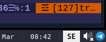

Display current Xkb layout as `i3block` block. It listens for Xkb events and detects then the keyboard layout has changed.

Example of `i3block` configuration:

```
[lang]
command=~/.config/i3blocks/language/rsxkblayout
interval=persist
format=json
```




No configurations currently available. Black on white text displaying current layout.


Example of X11 configuration:

```
Section "InputClass"
	Identifier	"keyboard"
	Driver		"evdev"
	MatchIsKeyboard	"on"
	Option 		"XkbModel" 	    "pc105"
	Option		"XkbLayout"	    "se,ru"
	Option		"XkbVariant"	"nodeadkeys"
	Option 		"XkbOptions" 	"grp:alt_shift_toggle"
EndSection
```

